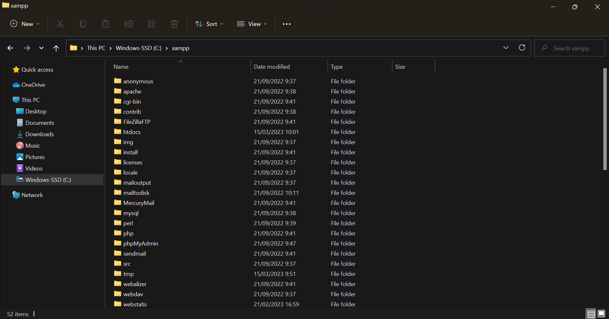

# PRATIKUM 2: PHP DASAR

**Nama : Nurul Najwa Sabilla**  
**Kelas : TI.21.A.3**  
**Nim : 312110451**  

## 1. Install XAMPP
Unduh Xampp pada browser. Kemudian, extract file pada laptop saya di C:\xampp file manager
  

  ## 2. Mengaktifkan Web Server (XAMPP)
  Pada modules Xampp ini terdapat menu Service dan berilah izin khususnya Apache
  

  ## 3. Mulai Membuat PHP
  Membuat FOLDER lab2_php_dasar pada C:\xampp\htdocs seperti dibawah ini:
  

  Untuk mengakses directory tersebut gunakan request http http://localhost/lab2_php_dasar/
  Dengan hasil output:
  

  ## 4. PHP Dasar dan Variabel PHP
  Mengisi FOLDER lab2_php_dasar dengan FILE php_dasar.php dan source code seperti ini:
  

  Dengan hasil output:
  

  ## 5. Predefine Variable $_GET
  Fungsi $_GET digunakan untuk mendapatkan nilai dari form yang menggunakan method="get". Informasi
  yang dikirimkan oleh form yang menggunakan method GET akan terlihat oleh user yang mengakses, karena
  akan muncul di addres bar dan informasi yang bisa diterima sangat terbatas. 
  Mengisi FOLDER lab2_php_dasar dengan FILE latihan2.php dan source code seperti ini:
  

 Untuk akses dengan request http : http://localhost/lab2_php_dasar/latihan2.php?nama=Najwa
 Dengan hasil output:

  ## 6. Form Input
  Form input dengan text field dan tombol button dengan hasil print saat data sudah terinput ini fungsi dari $_POST.
  Mengisi FOLDER lab2_php_dasar dengan FILE input.php dan source code seperti ini:
  

  Dengan hasil output:
  

  ## 7. Operator
  Perhitungan gaji menggunakan operator di php.
  Mengisi FOLDER lab2_php_dasar dengan FILE operator.php dan source code seperti ini:
  

  Dengan hasil output:
  

  ## 8. Kondisi IF
  Kondisi if digunakan jika pernyataan untuk mengeksekusi beberapa kode hanya jika kondisi tersebut itu adalah benar.
  Mengisi FOLDER lab2_php_dasar dengan FILE if.php dan source code seperti ini:
  

  Dengan hasil output:
  

 ## 9. Kondisi Switch
 Kondisi switch case percabangan dengan opsi yang banyak
 Mengisi FOLDER lab2_php_dasar dengan FILE switch.php dan source code seperti ini:
  

  Dengan hasil output:
  

  ## 10. Perulangan For
  Dengan increment dan decrement operators.
  Mengisi FOLDER lab2_php_dasar dengan FILE for.php dan source code seperti ini:
  

  Dengan hasil output:
  

  ## 11. Perulangan While
  Dengan increment operators. While akan melakukan perulangan kalau kondisi terpenuhi
  Mengisi FOLDER lab2_php_dasar dengan FILE while.php dan source code seperti ini:
  

  Dengan hasil output:
  

  ## 12. Perulangan Do While
   Do while melakukan perulangan dulu, kemudian memeriksa kondisinya.
   Mengisi FOLDER lab2_php_dasar dengan FILE do_while.php dan source code seperti ini:
  

  Dengan hasil output:
  

  ## 13. Praktikum 2
  Mengisi FOLDER lab2_php_dasar dengan FILE index.php dan source code seperti ini:
  
  
  

  

  Dengan hasil output:
  